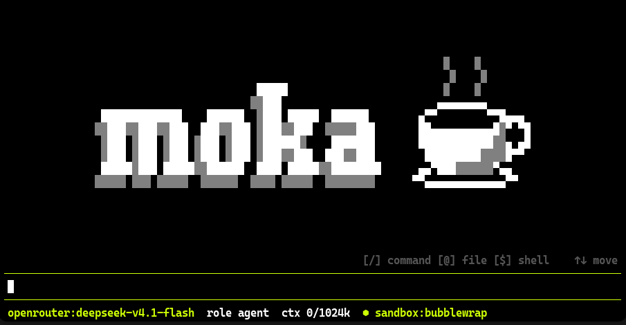

# moka-code

A terminal coding assistant for local and cloud models.

moka runs in your terminal, in your project folder. The model can read and edit
files and run commands, and every action goes through permissions you control,
optionally inside a sandbox. It works with local servers (llama.cpp, Ollama) as
well as cloud models through OpenRouter, and all settings are plain config
files.



## Requirements

- Linux, Python 3.10+
- A model server: [llama.cpp](https://github.com/ggml-org/llama.cpp),
  [Ollama](https://ollama.com), or an [OpenRouter](https://openrouter.ai) API key
- Optional: podman, docker or bubblewrap for sandboxes; `wl-paste` or `xclip`
  for pasting images

## Installation

```bash
pipx install git+https://github.com/roackim/moka-code.git
```

Then start it from the project you want to work on:

```bash
cd my-project
moka
```

## Quick start

moka starts without a model configured. Settings are edited with **`/config`**,
which opens the file in your `$EDITOR` and applies it when you close it.

1. Run **`/config servers`** and uncomment one of the examples, for instance:

   ```toml
   [servers.local]
   type = "llamacpp"
   base_url = "http://localhost:8080/v1"
   ```

2. Save and close the editor.
3. Run **`/model`** to pick a model, then type your first message.

For OpenRouter, export `OPENROUTER_API_KEY` before starting moka and uncomment
the OpenRouter example instead.

## Features

- **Tools with permissions.** The model can read, write and edit files and run
  shell commands. Each tool is allowed, asked, or disabled per role; switch
  roles with `/role`, edit them with `/config role <name>`.
- **Sandboxes.** Run the tools inside podman, docker or bubblewrap instead of
  directly on your machine (`/sandbox`). Sandboxes are defined per project.
- **Images.** Paste an image with Ctrl+V or mention a file with `@image.png`;
  the model can also read image files. Text-only models are detected and the
  message is refused with a clear explanation.
- **Conversations.** Export a conversation to a single file with `/export`
  (images included) and restore it with `/import`; `/compact` summarizes long
  conversations to free context.
- **Reasoning models.** The model's reasoning is shown above its answers and
  passed back to the model where the server supports it.
- **Terminal workflow.** `/terminal` opens a shell while the conversation keeps
  running, and `$ command` runs a one-off shell command.

## Configuration

Configuration lives in `~/.config/moka/` and is created on first run with
commented examples. Open a file with `/config <name>`:

| Name | Contents |
|---|---|
| `servers` | Model servers and models |
| `ui` | Theme, banner, status bar |
| `context` | Project context sent to the model, image size limit |
| `styles` | Markdown and code colors |
| `role <name>` | A role's system prompt and tool permissions |

Run `/help` for the full list of commands.
